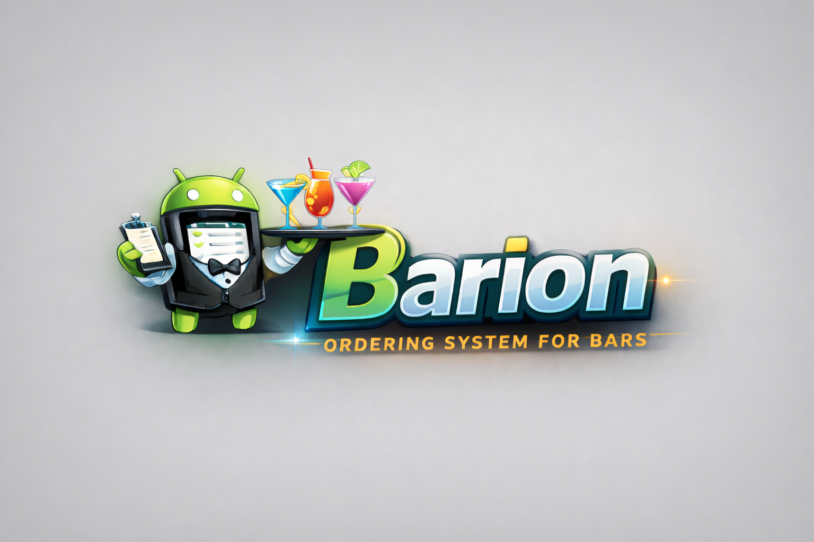

# POS Finestar Barion (Android)



Barion je tablet-first POS aplikacija za bar/klub rad: floor plan, otvoreni check kroz večer, dodavanje artikala po rundama i naplata/fiskalizacija na kraju.

## Trenutni status projekta

- Repo: `avrcanio/pos.finestar.barion`
- Android app package: `pos.finestar.barion`
- Trenutna app verzija: `versionCode=100`, `versionName=1.100`
- Backend base URL (default): `https://mozart.sibenik1983.hr/`

## Issue status (GitHub)

Pregledano je svih 48 issue-a.

- Zatvoreno: `44`
- Otvoreno: `4` (`#33`, `#42`, `#43`, `#44`)
- Najnovije zatvoreno: `#46`, `#47`, `#48`

### Što je isporučeno kroz issue-e

- `#1-#6`: Compose osnova, navigacija, floor canvas, check screen.
- `#19-#24`: Add-items epic (read flow, add/update/remove, totals, UX dorade).
- `#25`: PIN login + `/api/me` bootstrap + token session + interceptor + step-up verify za naplatu.
- `#26`: model rundi (`round_number`, `sent_to_bar`, `sent_at`) i slanje runde na šank.
- `#28`: Add Item split UX (kategorije + grid artikala sa slikama), košarica i round flow.
- `#30`: Storno/Gratis/Otpis flow s audit tragom i UI označavanjem.
- `#31`: deterministički products query (`sort=popular`) i limitiranje listanja (`limit=100`).
- `#32`, `#34-#41`: Payment Flow v1 (full/split, settlement partovi, cash/card confirm, status tranzicije, backend contracti).
- `#46`, `#48`: modifiers/opcije po artiklu (long-press konfiguracija, note, simple/bundle hibrid, bundle preview, markeri u UI).
- `#47`: day/night runtime mode podrška (runtime-mode endpoint + prikaz trenutnog moda u app-u).

## Funkcionalnosti u aplikaciji

- Auth gate + PIN login ekran.
- Session persistence (DataStore), auto-bootstrap preko `/api/me/`.
- Floor plan prikaz stolova s layout switch chipovima.
- Otvaranje/učitavanje checka po stolu.
- Check pregled po rundama (`R1`, `R2`, `NEW`) + subtotal/tax/total.
- Long press na stavku: `Storno`, `Gratis`, `Otpis` (qty + reason).
- Add items ekran:
  - kategorije (`level=2`),
  - grid artikala sa slikama,
  - tap = quick add, long-press = konfiguracija artikla,
  - modifiers (simple/bundle) + note po artiklu,
  - bundle price preview prije dodavanja,
  - badgevi za artikle s opcijama/konfiguracijom,
  - košarica + slanje runde.
- Check prikaz koristi `round-state` + `settlement-state`:
  - prikaz paid linija,
  - prikaz preostalih količina po itemu,
  - fiskalizacija pojedinog računa iz liste `Plaćeni računi`.
- FREE flow: kad je total `0.00`, gumb `Naplata` postaje `Free` i zatvara check bez PIN-a.
- Payment Sprint 1:
  - izbor `Kompletna naplata` vs `Naplati dio (Split)`,
  - split wizard s remaining qty guardovima,
  - split summary s part statusima (`PREPARED/PAID/FAILED`),
  - per-part pay (`Gotovina` / `Kartica` confirm),
  - close check guard tek kad su svi partovi plaćeni i remaining qty = 0.
- Runtime mode indikator (sunce/mjesec) na floor planu + ručni refresh moda.

## API endpointi koje Android koristi

### Auth

- `POST /api/pos/pin/login/`
- `POST /api/pos/pin/verify/`
- `GET /api/me/`

### Floor/layout

- `GET /api/pos/active-layout/`
- `GET /api/pos/runtime-mode/`
- `GET /api/pos/layouts/allowed/`
- `GET /api/pos/table-status/?layout_id=...`

### Katalog

- `GET /api/pos/bootstrap/?include_products=1`
- `GET /api/pos/categories/display/`
- `GET /api/pos/products/search/?category_id=...&q=...&limit=100&sort=popular`
- `GET /api/pos/products/{artikl_id}/modifiers/`
- `POST /api/pos/products/{artikl_id}/bundle-price/`
- granularni endpointi i dalje ostaju za daljnju navigaciju i pretragu
- fallback/legacy podrška: `GET /api/artikli/`

### Check + items

- `POST /api/pos/checks/`
- `GET /api/pos/checks/?table_id=...`
- `GET /api/pos/checks/{check_id}/items/`
- `POST /api/pos/checks/{check_id}/items/`
- `PATCH /api/pos/check-items/{item_id}/`
- `DELETE /api/pos/check-items/{item_id}/`
- `POST /api/pos/check-items/{item_id}/storno/`
- `POST /api/pos/check-items/{item_id}/gratis/`
- `POST /api/pos/check-items/{item_id}/otpis/`
- `POST /api/pos/checks/{check_id}/send-to-bar/`
- `POST /api/pos/checks/{check_id}/close/`
- `POST /api/pos/checks/{check_id}/issue-receipt/`

### Settlement (Payment Sprint 1)

- `POST /api/pos/checks/{check_id}/prepare-settlement/`
- `POST /api/pos/checks/{check_id}/settlements/parts/{part_id}/pay-cash/`
- `POST /api/pos/checks/{check_id}/settlements/parts/{part_id}/pay-card/confirm/`
- `POST /api/pos/checks/{check_id}/pay-card/confirm/`
- `GET /api/pos/checks/{check_id}/settlement-state/`
- `GET /api/pos/checks/{check_id}/round-state/`
- `POST /api/pos/checks/{check_id}/receipts/{receipt_id}/fiscalize/`

Cash contract napomena:
- `prepare` može i bez body-a (backend auto full CASH part).
- `pay-cash` trenutno backend očekuje i na `part_id=0` za auto-finalize cash flow.

## Cache i performanse (implementirano)

Implementiran je Room cache + SWR (stale-while-revalidate) za ključne endpointe:

- `/api/pos/active-layout/`
- `/api/pos/layouts/allowed/`
- `/api/pos/bootstrap/`
- `/api/pos/products/search/`
- `/api/pos/checks/{id}/items/`

Strategija:

1. UI odmah dobiva cache ako postoji.
2. U pozadini ide network refresh (`forceRefresh=true`).
3. Kad stigne svježi payload, state se tiho ažurira.

Periodični cleanup cachea:

- WorkManager job `api_cache_cleanup_periodic`
- interval: svakih `24h` (initial delay `12h`)
- čišćenje: `deleteOlderThan(...)`, retention `3 dana`

## Tehnologije

- Kotlin, Jetpack Compose
- Hilt DI
- Retrofit + OkHttp
- Room (cache)
- WorkManager (periodični cleanup)
- DataStore (session)
- Coroutines + Flow

## Lokalni razvoj

### Build debug

```bash
./gradlew :app:assembleDebug
```

### Unit testovi

```bash
./gradlew :app:testDebugUnitTest
```

### Prod-like debug build script

```bash
scripts/build_prodNogmsDebug.sh
```

Napomena:

- Script očekuje signer secrets file preko `POS_SIGNER_SECRETS`.
- Ako nije postavljen, koristi default path u skripti.

## Struktura projekta

- `app/src/main/java/pos/finestar/barion/auth` - auth gate, PIN login, session bootstrap
- `app/src/main/java/pos/finestar/barion/floorplan` - floor rendering, layout selector
- `app/src/main/java/pos/finestar/barion/check` - check prikaz, round totals, storno/gratis/otpis, pay/free
- `app/src/main/java/pos/finestar/barion/additem` - pretraga artikala, kategorije, košarica, slanje runde
- `app/src/main/java/pos/finestar/barion/data/repo` - API + mapiranja + cache sloj
- `app/src/main/java/pos/finestar/barion/data/local` - Room cache + cleanup worker
- `app/src/main/java/pos/finestar/barion/domain` - modeli, repo ugovori, use-casevi
- `docs/qa` - QA checklist i contract test napomene

## Otvorene stavke

- `#33`: tips per card settlement part (epic).
- `#42`: card tip sheet (`0/5/10/custom`) + confirm UI.
- `#43`: tip calculation (cents) + Viva request/confirm mapping.
- `#44`: declined/retry flow testovi + receipt handoff.

---

Ako želiš, mogu odmah nakon ovoga napraviti i `README` verziju na engleskom (za vanjske suradnike) i commitati obje verzije.
